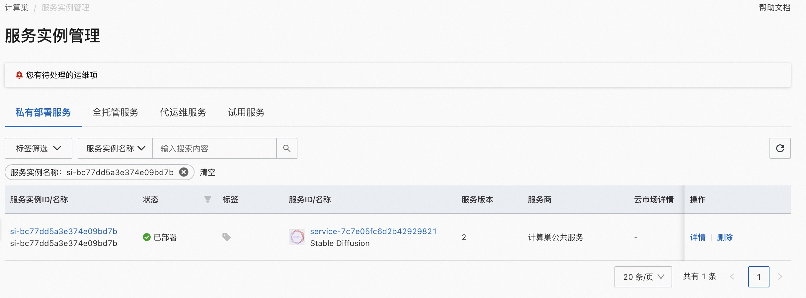
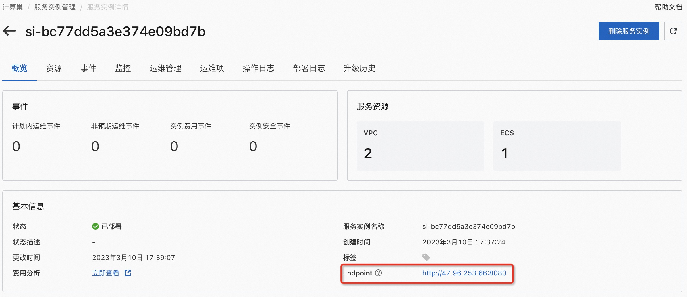

# stable-diffusion服务实例部署文档
## 概述
Stable Diffusion Web UI 是一个基于 Stable Diffusion 的基础应用，利用 gradio 模块搭建出交互程序，可以在低代码 GUI 中立即访问 Stable Diffusion。它支持文字生成图片，图片转图片，使用各种各样的模型来达到你想要的效果，还能训练自己的专属模型。本文向您介绍如何开通计算巢上的stable-diffusion服务，以及部署流程和使用说明。
##
## 计费说明
stable-diffusion在计算巢上的费用主要涉及：

- 所选vCPU与内存规格
- 磁盘容量
- 公网带宽

计费方式包括：

- 按量付费（小时）
- 包年包月

预估费用在创建实例时可实时看到。
##
## 部署架构
stable-diffusion服务单机部署架构。

##
## RAM账号所需权限
stable-diffusion服务需要对ECS、VPC等资源进行访问和创建操作，若您使用RAM用户创建服务实例，需要在创建服务实例前，对使用的RAM用户的账号添加相应资源的权限。添加RAM权限的详细操作，请参见[为RAM用户授权](https://help.aliyun.com/document_detail/121945.html)。所需权限如下表所示。

| 权限策略名称 | 备注 |
| --- | --- |
| AliyunECSFullAccess | 管理云服务器服务（ECS）的权限 |
| AliyunVPCFullAccess | 管理专有网络（VPC）的权限 |
| AliyunROSFullAccess | 管理资源编排服务（ROS）的权限 |
| AliyunComputeNestUserFullAccess | 管理计算巢服务（ComputeNest）的用户侧权限 |
| AliyunCloudMonitorFullAccess | 管理云监控（CloudMonitor）的权限 |

##
## 部署流程
### 部署步骤
单击[部署链接](https://computenest.console.aliyun.com/user/cn-hangzhou/serviceInstanceCreate?ServiceId=service-7c7e05fc6d2b42929821)，进入服务实例部署界面，根据界面提示，填写参数完成部署。

### 
### 部署参数说明
您在创建服务实例的过程中，需要配置服务实例信息。下文介绍stable-diffusion服务实例输入参数的详细信息。

| 参数组     | 参数项    | 示例           | 说明                       |
|---------|--------|--------------| --- |
| 服务实例名称  |        | test         | 实例的名称                    |
| 地域      |        | 华东1（杭州）      | 选中服务实例的地域，建议就近选中，以获取更好的网络延时。 |
| 可用区配置   | 部署区域   | 可用区I         | 地域下的不同可用区域               |
| 付费类型配置  | 付费类型   | 按量付费 或 包年包月  |
| ECS实例配置 | 实例类型   | ecs.gn6i-c4g1.xlarge | 实例规格，可以根据实际需求选择          |
| ECS实例配置 | 实例密码   | ********     | 设置实例密码。长度8~30个字符，必须包含三项（大写字母、小写字母、数字、()`~!@#$%^&*-+={}[]:;'<>,.?/ 中的特殊符号） |
| 网络配置    | 专有网络IPv4网段  | 192.168.0.0/16     | VPC的ip地址段范围 |
| 网络配置    | 交换机子网网段   | 192.168.0.0/24     | 交换机子网网段 |

##
### 验证结果

1. 查看服务实例。
服务实例创建成功后，部署时间大约需要2分钟。部署完成后，页面上可以看到对应的服务实例。

2. 通过服务实例访问stable-diffusion

进入到对应的服务实例后，可以在页面上获取到Endpoint以访问服务。

### 帮助文档
请访问[stable-diffusion使用文档](https://github.com/wangwangbobo/stable-diffusion-webui)了解如何使用。
